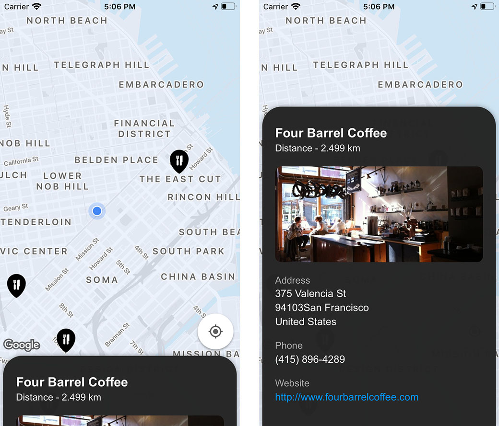

# Find Restaurants
**Find Restaurants** is an iOS app that lets users find restaurants around their location. More restaurants can be loaded by panning on the map.

## Overview
Restaurants information is retrieved using the Foursquare Places API, and is displayed on Google Maps. API keys for both Foursqare and Google Maps are not available in the app. To be able to run the app, keys need to be inserted in placeholders in "KEY\_PLACEHOLDER", "CLIENT\_ID\_PLACEHOLDER" and "CLIENT\_SECRET\_PLACEHOLDER". Note that in a production project, these keys need to be securely stored. Some of the best practises are:

* Not storing sensitive data in project source base. These can be injected suring CI/CD.
* Injecting encrypted data with encription keys.
* Obfuscating the encryption keys.

Once keys are inserted, run "bootstrap_workspace.sh" to build app dependencies, then compile and run in XCode.

The app does not implement storage persistency, thus all loaded restaurants are lost when the app is relaunched.

Not all functionality is tested in the source base, but example unit tests are provided for the Restaurants Interactor class. The provided Mocks are automatically generated with [Sourcery](https://github.com/krzysztofzablocki/Sourcery) using [Stencil](https://github.com/stencilproject/Stencil) templates.

## Illustration

